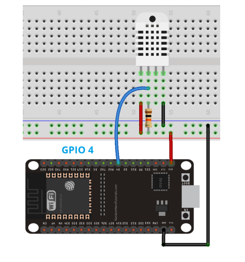
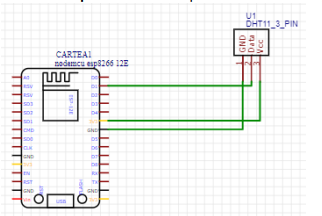
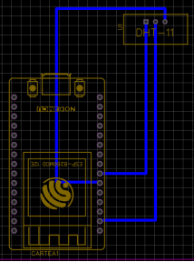
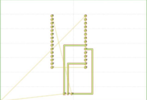
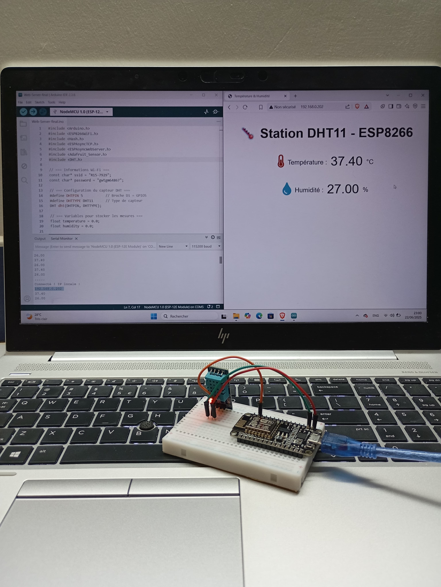
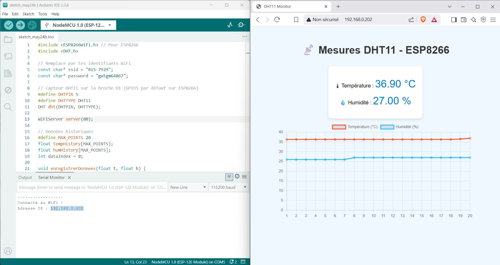
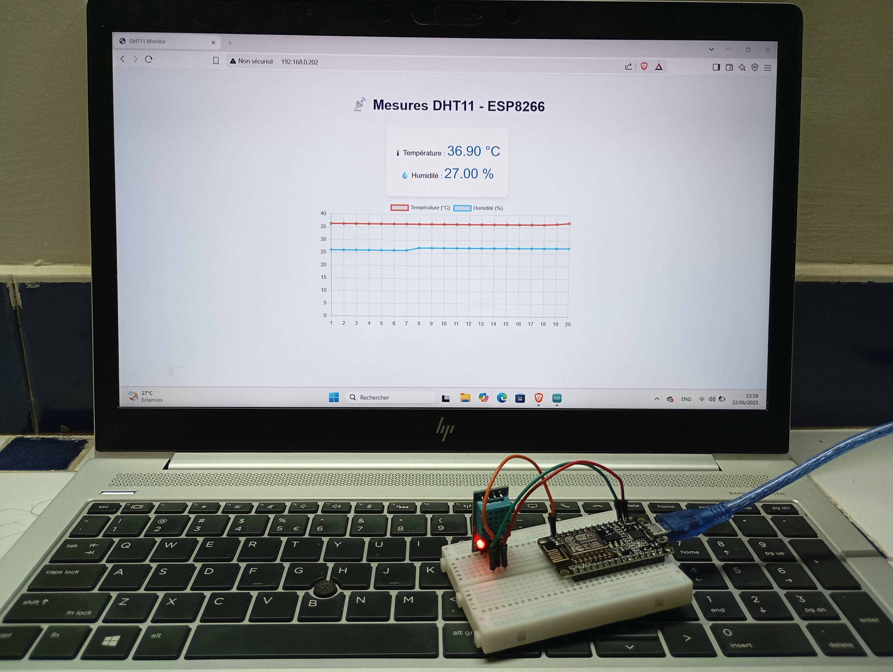
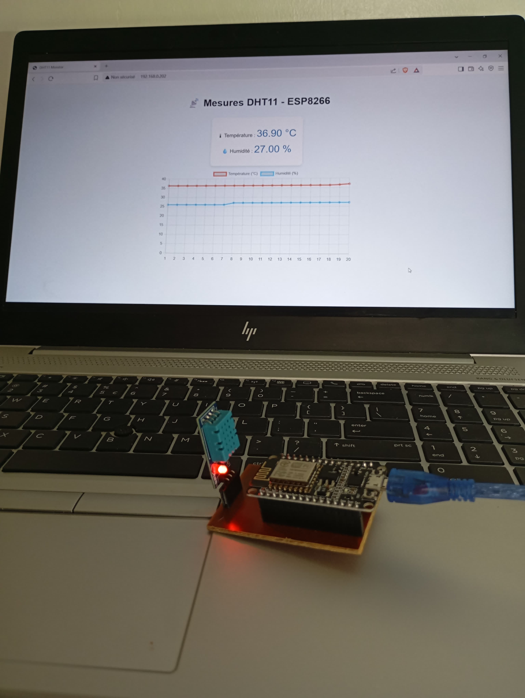

# 🌡️ Station Météo ESP8266 + DHT11 — Serveur Web en temps réel


Projet IoT de surveillance de la température et de l'humidité en temps réel, accessible depuis n'importe quel navigateur web sur le réseau local. Deux versions du projet ont été développées : une version simple (affichage statique) et une version avancée avec graphiques dynamiques.

---

## 📋 Description

L'ESP8266 (NodeMCU) lit les données du capteur DHT11 toutes les 10 secondes et les expose via un serveur web asynchrone embarqué. L'utilisateur accède à l'interface en entrant simplement l'adresse IP de la carte dans son navigateur — sans application ni installation supplémentaire.

Deux versions ont été réalisées :
- **Version simple** (`Station DHT11 - ESP8266`) : affichage temps réel de la température et de l'humidité avec rafraîchissement automatique via AJAX.
- **Version avancée** (`Mesures DHT11 - ESP8266`) : même fonctionnalité, enrichie d'un graphique dynamique affichant l'historique des 20 dernières mesures.

---

## 🛠️ Matériel utilisé

| Composant | Description |
|-----------|-------------|
| NodeMCU ESP8266 (ESP-12E) | Microcontrôleur Wi-Fi |
| DHT11 | Capteur température & humidité |
| Résistance 10kΩ | Pull-up sur la broche DATA |
| Breadboard | Prototype sur platine |
| PCB personnalisé | Version finale gravée (EasyEDA + FlatCAM) |
| Câble USB | Alimentation et programmation |

---

## ⚡ Schéma de câblage

### Breadboard


| DHT11 (broche) | NodeMCU |
|----------------|---------|
| VCC | 3.3V |
| DATA | D1 (GPIO5) |
| GND | GND |

> Une résistance de 10kΩ est placée entre VCC et DATA (pull-up).

### Schéma électrique (EasyEDA)


### Vue PCB (EasyEDA)


### Fichier FlatCAM (gravure PCB)


---

## 💻 Stack technique

| Technologie | Rôle |
|-------------|------|
| Arduino IDE 2.3.6 | Environnement de développement |
| ESP8266WiFi | Connexion au réseau Wi-Fi |
| ESPAsyncWebServer | Serveur HTTP asynchrone |
| ESPAsyncTCP | Couche TCP asynchrone |
| DHT (Adafruit) | Lecture du capteur |
| HTML / CSS / JS | Interface web embarquée |
| AJAX (XMLHttpRequest) | Mise à jour sans rechargement |

---

## 📦 Bibliothèques à installer

Dans l'Arduino IDE, installez via **Tools → Manage Libraries** :

- `DHT sensor library` — Adafruit
- `Adafruit Unified Sensor` — Adafruit
- `ESPAsyncTCP` — me-no-dev (GitHub)
- `ESPAsyncWebServer` — me-no-dev (GitHub)

---

## 🚀 Installation & Utilisation

### 1. Cloner le dépôt
```bash
git clone https://github.com/JIHANE-04/esp8266-dht11-webserver.git
```

### 2. Configurer les identifiants Wi-Fi
Ouvrez `src/Web-Server-final.ino` et modifiez :
```cpp
const char* ssid     = "VOTRE_SSID";
const char* password = "VOTRE_MOT_DE_PASSE";
```

### 3. Installer le board ESP8266
Dans Arduino IDE → **File → Preferences**, ajoutez cette URL :
```
http://arduino.esp8266.com/stable/package_esp8266com_index.json
```
Puis **Tools → Board → Boards Manager** → installez `esp8266`.

### 4. Configurer la carte
- **Board** : `NodeMCU 1.0 (ESP-12E Module)`
- **Upload Speed** : `115200`
- **Port** : le port COM de votre carte

### 5. Téléverser et accéder à l'interface
Après téléversement, ouvrez le **Serial Monitor** à 115200 bauds pour récupérer l'adresse IP, puis entrez-la dans votre navigateur.

---

## 📊 Résultats

### Version simple — Station DHT11
Affichage en temps réel de la température et de l'humidité, mis à jour toutes les 10 secondes.



### Version avancée — Graphique dynamique
Historique des 20 dernières mesures affiché sous forme de graphique en temps réel.




### Montage sur breadboard


### Version finale sur PCB
PCB gravé manuellement à partir du schéma EasyEDA, exporté via FlatCAM.



---

## 🔌 Routes HTTP disponibles

| Route | Méthode | Description |
|-------|---------|-------------|
| `/` | GET | Page HTML principale |
| `/temperature` | GET | Valeur brute de la température (°C) |
| `/humidity` | GET | Valeur brute de l'humidité (%) |

---

## 📁 Structure du projet

```
esp8266-dht11-webserver/
├── src/
│   └── Web-Server-final.ino        # Code source principal
├── images/
│   ├── schema_cablage_fritzing.png
│   ├── schema_easyeda_electrique.png
│   ├── schema_easyeda_pcb.png
│   ├── schema_flatcam.png
│   ├── interface_station_dht11.png
│   ├── interface_web_graphique.png
│   ├── arduino_ide_graphique.png
│   ├── montage_breadboard_graphique.png
│   └── montage_pcb_final.png
└── README.md
```

---

## 👩‍💻 Auteur

**JIHANE-04** — Projet réalisé dans le cadre d'un portfolio académique.

---

## 📄 Licence

Ce projet est sous licence MIT — libre d'utilisation, de modification et de distribution.
